<!-- Improved compatibility of back to top link: See: https://github.com/othneildrew/Best-README-Template/pull/73 -->

<!--
*** Thanks for checking out the Best-README-Template. If you have a suggestion
*** that would make this better, please fork the repo and create a pull request
*** or simply open an issue with the tag "enhancement".
*** Don't forget to give the project a star!
*** Thanks again! Now go create something AMAZING! :D
-->

<!-- PROJECT SHIELDS -->
<!--
*** I'm using markdown "reference style" links for readability.
*** Reference links are enclosed in brackets [ ] instead of parentheses ( ).
*** See the bottom of this document for the declaration of the reference variables
*** for contributors-url, forks-url, etc. This is an optional, concise syntax you may use.
*** https://www.markdownguide.org/basic-syntax/#reference-style-links
-->
[![Contributors][contributors-shield]][contributors-url]
[![Forks][forks-shield]][forks-url]
[![Stargazers][stars-shield]][stars-url]
[![Issues][issues-shield]][issues-url]
[![LinkedIn][linkedin-shield]][linkedin-url]

<!-- PROJECT LOGO -->
 

<a href="https://github.com/fqt111/Fresh-Food-E-commerce-Solution-on-WeChat-Mini-Program">
    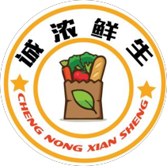
</a>

<h3 align="center">PureHarvest FreshLife: Fresh Food E-commerce Solution on WeChat Mini Program</h3>
  

    中文名：诚浓鲜生——在线食材初处理平台
     
    12th Innovation Creativity Entrepreneurship
     
    <a href="https://github.com/fqt111/Fresh-Food-E-commerce-Solution-on-WeChat-Mini-Program"><strong>Explore the docs »</strong></a>
     
  

<!-- TABLE OF CONTENTS -->

  
Table of Contents

  <ol>
    <li>
      <a href="#about-the-project">About The Project</a>
    </li>
    <li>
      <a href="#system-architecture">System Architecture</a>
    </li>
    <li><a href="#function">Function</a>
    <ul>
        <li><a href="#home-page">Home page</a></li>
        <li><a href="#search-page">Search page</a></li>
        <li><a href="#category-page">Category page</a></li>
        <li><a href="#item-and-set-meals-details-page">Item and set meals details page</a></li>
        <li><a href="#shopping-cart">Shopping cart</a></li>
        <li><a href="#settlement-page">Settlement page</a></li>
        <li><a href="#merchant-page">Merchant page</a></li>
        <li><a href="#order-page">Order page</a></li>
        <li><a href="#merchant-management-order">Merchant management order</a></li>
        <li><a href="#supplier-page">Supplier page</a></li>
        <li><a href="#rtmp-video-streaming-server">RTMP Video Streaming Server</a></li>
      </ul>
    </li>
    <li><a href="#contact">Contact</a></li>
    <li><a href="#acknowledgments">Acknowledgments</a></li>
  </ol>

<!-- ABOUT THE PROJECT -->
## About The Project

The project is an innovative fresh food delivery platform that operates through a WeChat Mini Program mobile app. It aims to integrate resources from rural suppliers and cater to the convenient cooking demands of urban customers. The platform emphasizes the traceability of high-quality ingredients and offers fully-monitored initial food processing services. This initiative seeks to establish a pathway for delivering fresh and fast rural produce to urban dining tables, thereby engaging in differentiated competition with existing fresh food delivery platforms to capture the market.

In recent years, new business models represented by the digital economy and sharing economy have rapidly developed. Leveraging the vigorous growth of China's logistics and delivery service industries, the food delivery market has attracted significant attention from numerous companies. Simultaneously, urban residents' demands for food quality have been increasing daily, leading major supermarkets and food delivery giants to enter the fresh food delivery sector. With China's nearly 6 trillion RMB fresh retail market, the proportion of online sales has been steadily rising, reaching 14.6% in 2020 due to the impact of the pandemic. Coupled with recent pandemic influences, offline shopping has been hindered, intensifying the competition in the food delivery industry. Existing market leaders in fresh food delivery have attempted marketing strategies, delivery methods, and other innovations, yet there remains ample room for continuous innovation. "ChengNong FreshLife," the fresh food initial processing platform, plans to break the competitive pattern by focusing on product types and service quality.

"PureHarvest FreshLife" integrates various services such as online selection and offline reservation for self-pickup. The company's primary business includes three parts. Firstly, there's a fresh food Mini Program developed using WeChat's developer tools. This program serves as a hub for product purchases, allowing merchants to update product details through the Mini Program while customers can browse, order, and track order status. Secondly, there are offline self-pickup stores where customers can either pick ingredients in-store or place orders through the Mini Program, notifying the store to prepare the items. Equipped with compliant cameras, these self-pickup stores enable customers to witness the entire initial processing process, ensuring transparency, hygiene, and safety. Thirdly, there's the company's warehouse, which follows comprehensive storage rules to ensure freshness and timely delivery to self-pickup stores or customers.

The FreshLife team has developed a detailed company development strategy aligned with the project's establishment needs. The initial strategy involves regional pilot programs, establishing offline delivery stations, and offering both in-store pickup and home delivery services. Starting from an improved community group-buying model, the team conducts pilot surveys in customer-concentrated areas. In the mid-term (development phase), the strategy involves introducing warehousing functions into offline stores, transforming some regional sites into large-scale fresh food shopping experience centers that integrate warehousing, initial processing, self-pickup, and delivery services, achieving decentralized fast delivery. In the later stages, the strategy focuses on enhancing the quantity and quality of stores and expanding to other cities, broadening the platform's business to cater to various levels of cities' sales demands for rural agricultural products and urban needs for purchasing fresh ingredients and quickly cooking dishes.

## System Architecture
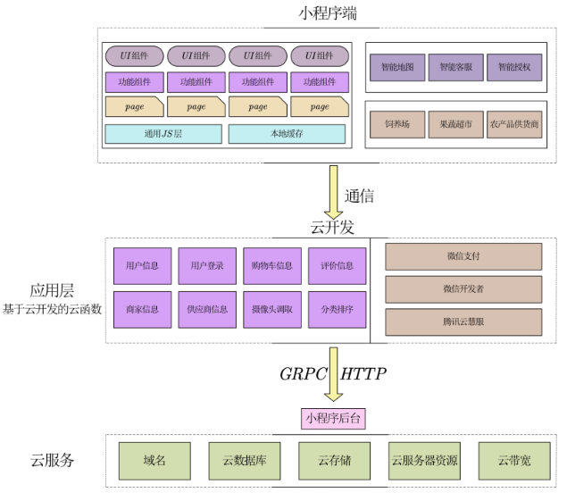

The system architecture primarily consists of three components: the Mini Program frontend, the Application Layer, and the Cloud Services Layer. The Mini Program frontend is responsible for displaying visual components, integrating Tencent's intelligent map, customer service, authorization, and serving both customers and business partners. The Application Layer includes cloud functions built on cloud development, utilized for reading and modifying user, shopping, and merchant information. The Cloud Services Layer in the backend of the Mini Program encompasses cloud databases, cloud storage, and other modules. These are used to perform CRUD operations through requests, and additionally, real-time video streaming is achieved by interfacing with the RTMP server.

## Function
### Home page

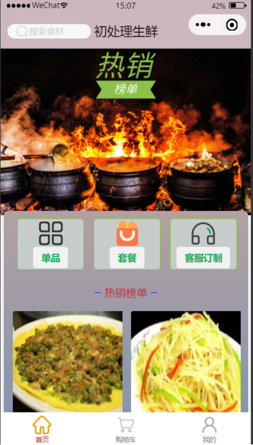

1. The homepage adopts the flip-down style, which can be extended when flipped down.
2. Top: Search for the products owned by the platform.
3. Classification column for item and set meal: to realize the jump to the classification page.
4. Customized service: VIP exclusive private preliminary treatment customization, which can conduct one-on-one communication with offline business personnel.
5. Best-selling list: Recommend the current overheated initial treatment set meals, making it more convenient for users to browse products.

### Search page

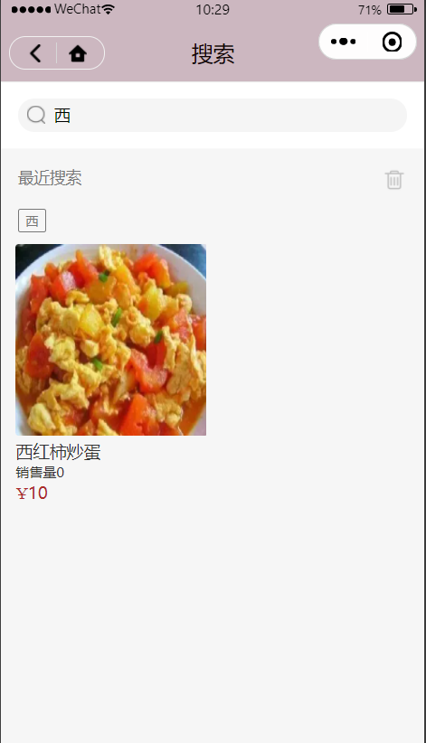

1. Carry out keyword fuzzy search for Item and set meal
2. You can view historical search records
3. List the search results for selection

### Category page

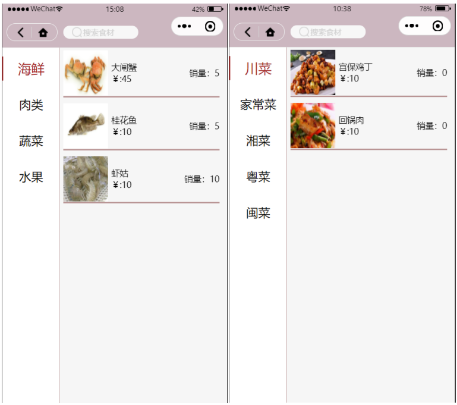

1. Item: seafood, meat, vegetables, fruits, staple food.
2. Set meal: Sichuan cuisine, home cooking, Fujian cuisine, Hunan cuisine, Cantonese cuisine.
3. Each category has a variety of ingredients.
4. Each ingredient has a star rating.

### Item and set meals details page

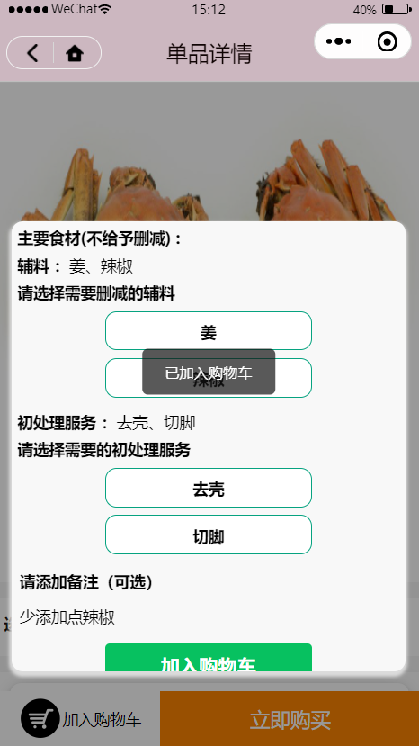

1. Item page: provide item information, pop-up windows to select the initial processing method, effect display map, add accessories, and view comments.
2. Package page: Provide set meal information, initial processing operations, pop-up window to select accessories to add, and view comments.
3. Add to cart or buy now.

### shopping cart

1. Display the set meal or item added in the details page, and list the initial treatment method and auxiliary material addition information selected by the user at the same time, which is convenient for the user to view intuitively.
2. You can modify the purchased product information.

### Settlement page

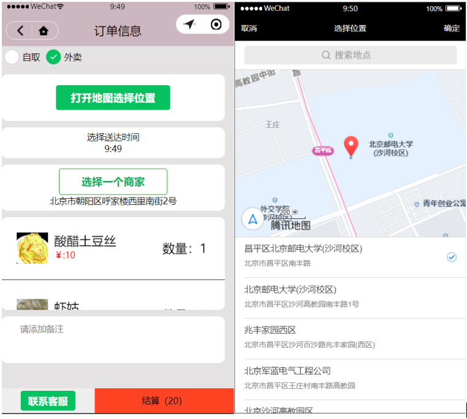

1. The user can choose self-pickup or takeaway delivery. Self-pickup will get the user's current address and return to the nearest merchant, and takeaway will return to the nearest merchant according to the address selected by the user.
2. Provide an entrance for offline merchants to choose from. You can choose according to distance and ratings, and you can also view detailed information (location pictures and reviews) of pick-up points.
3. The delivery address can be selected through the map component
4. You can choose the delivery time

### Merchant page

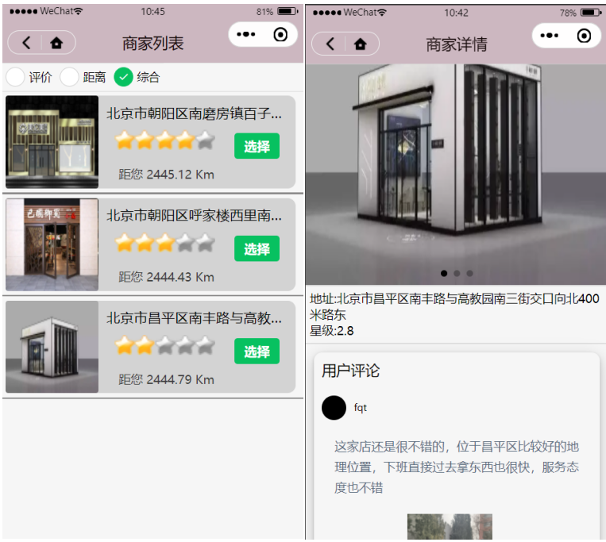

1. Sort by evaluation, distance and comprehensive (weighted sum of evaluation and distance)
2. You can view the detailed page of the merchant to learn more about the merchant information and evaluation
3. Users can choose merchants arbitrarily according to the situation

### Order page

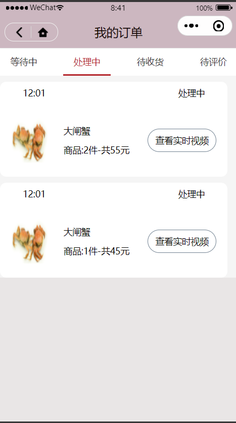

1. There are waiting, processing, shipped, and delivered statuses.
2. The platform provides real-time video of the initial processing process to ensure transparency.
3. After delivery, the real-time rider's location and estimated time of arrival will be displayed.
4. After the order has been delivered, you can view the video recording of the initial processing and evaluate the order.

### Merchant management order

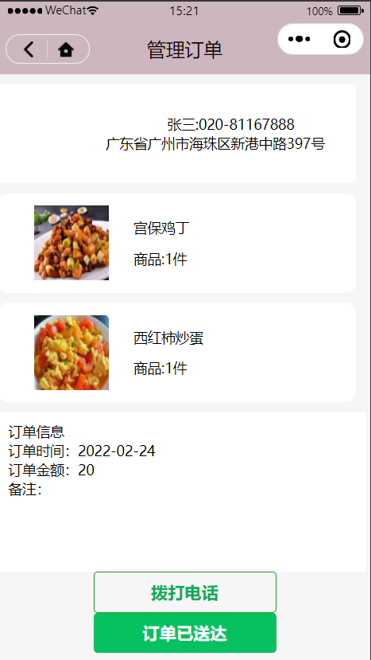

1. Realize the conversion of waiting, processing, shipped, and delivered modes.
2. List the existing order information of each merchant
3. Dynamically add and modify product information according to the needs of suppliers and users.
4. Publish food material requirements to suppliers.

### Supplier page

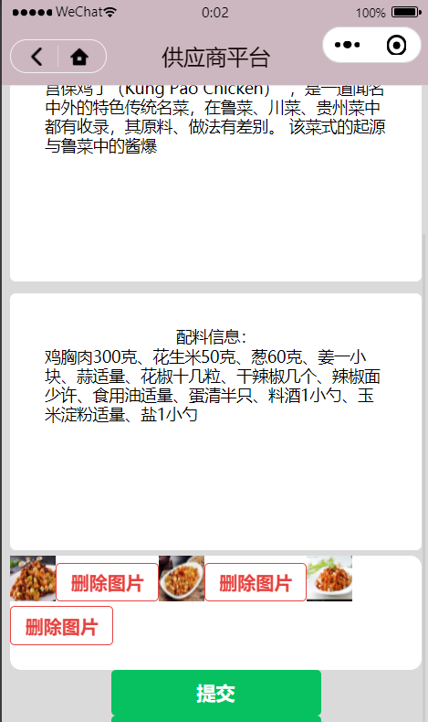

1. Provide a registration process to achieve cooperation with the platform.
2. Receive the food material requirements of the platform.
3. You can change the information such as the variety and quantity of food supply by yourself.

### RTMP Video Streaming Server

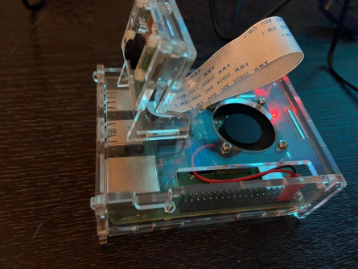

Realized a real-time display system of business operation based on Raspberry Pi, the technical core is divided into three parts:
1. Environment construction and hardware deployment configuration: Refer to official documents and manuals for Raspberry Pi environment construction, install Linux system, and install ffmpeg. Camera connection and local video stream acquisition, purchase camera equipment, connect with Raspberry Pi page, open camera permissions in the system, and use command line control.
2. Communication between the local device and the server: install the rtmp server on the cloud, configure the rtmp information, and push the stream to the rtmp server through the command line on the Raspberry Pi
3. User-end use: Use the small program live-player component to realize video playback and check the operation status of the merchant in real time.

<!-- CONTACT -->
## Contact

Feng Qingtian - feng_qingtian@u.nus.edu

(<a href="#readme-top">back to top</a>)

<!-- ACKNOWLEDGMENTS -->
## Acknowledgments

Adviser: Tian Hua

Team members
* Wang Runtao
* Huang Lingxiao
* Jia Yuchen
* Sha Tianmu
* Yu Liyang
* Liu Jinhao

(<a href="#readme-top">back to top</a>)

<!-- MARKDOWN LINKS & IMAGES -->
<!-- https://www.markdownguide.org/basic-syntax/#reference-style-links -->
[contributors-shield]: https://img.shields.io/github/contributors/fqt111/Fresh-Food-E-commerce-Solution-on-WeChat-Mini-Program.svg?style=for-the-badge
[contributors-url]: https://github.com/fqt111/Fresh-Food-E-commerce-Solution-on-WeChat-Mini-Program/graphs/contributors
[forks-shield]: https://img.shields.io/github/forks/fqt111/Fresh-Food-E-commerce-Solution-on-WeChat-Mini-Program.svg?style=for-the-badge
[forks-url]: https://github.com/fqt111/Fresh-Food-E-commerce-Solution-on-WeChat-Mini-Program/network/members
[stars-shield]: https://img.shields.io/github/stars/fqt111/Fresh-Food-E-commerce-Solution-on-WeChat-Mini-Program.svg?style=for-the-badge
[stars-url]: https://github.com/fqt111/Fresh-Food-E-commerce-Solution-on-WeChat-Mini-Program/stargazers
[issues-shield]: https://img.shields.io/github/issues/fqt111/Fresh-Food-E-commerce-Solution-on-WeChat-Mini-Program.svg?style=for-the-badge
[issues-url]: https://github.com/fqt111/Fresh-Food-E-commerce-Solution-on-WeChat-Mini-Program/issues
[license-shield]: https://img.shields.io/github/license/fqt111/Fresh-Food-E-commerce-Solution-on-WeChat-Mini-Program.svg?style=for-the-badge
[license-url]: https://github.com/fqt111/Fresh-Food-E-commerce-Solution-on-WeChat-Mini-Program/blob/master/LICENSE.txt
[linkedin-shield]: https://img.shields.io/badge/-LinkedIn-black.svg?style=for-the-badge&logo=linkedin&colorB=555
[linkedin-url]: https://www.linkedin.com/in/qingtian-feng-4b1055288/
